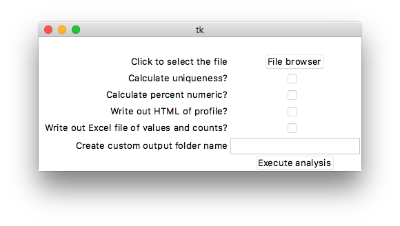
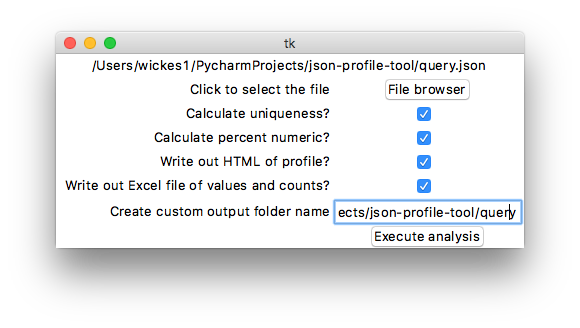

# JSON profile tool

* `jpt.py` main program with tkinkter application (run this one for gui)
* `json_profile_tools.py` general functions and tools for performing analysis

TODO

* more docs
* tidy up with better directions
